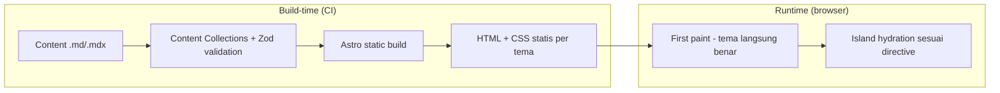
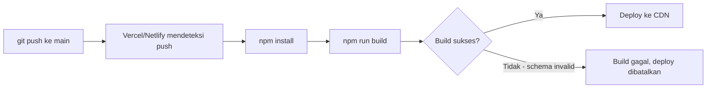
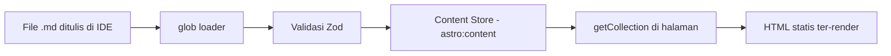
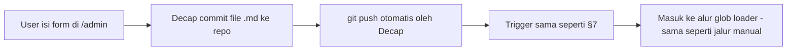

# SDD — Personal Portfolio Website
**Software Design Document / System Design**
Versi: 1.1 | Status: Draft (terisi) | Turunan dari: PRD, SRS v1.0

> Catatan versi: detail implementasi visual per tema (warna spesifik, aset dekoratif, dsb.) sengaja **tidak** dijabarkan di sini — masing-masing didokumentasikan terpisah di `/docs/design-system/[nama-tema].md`. Dokumen ini fokus ke arsitektur yang membuat sistem multi-tema itu *bisa jalan*, bukan isi visual tiap tema.

---

## 1. Architecture Overview

Situs ini adalah **static site dengan island interaktif** (arsitektur Astro), tanpa server aplikasi custom:

- **Build-time**: Astro membaca seluruh konten (`.md`/`.mdx` di Content Collections), memvalidasi terhadap schema Zod, lalu men-generate HTML statis untuk setiap halaman (Home, Projects, Blog list, Blog detail). Semua styling (termasuk seluruh tema) sudah ter-compile jadi CSS statis pada tahap ini — tidak ada logic tema yang berjalan di server saat runtime.
- **Runtime (browser)**: HTML+CSS statis dikirim ke browser terlebih dahulu (fast first paint). Island (komponen React: ThemeSwitcher, komponen shadcn/ui, animasi Motion, scene Three.js) baru di-hydrate setelah itu, sesuai directive masing-masing (lihat §6).
- **Batas statis vs interaktif**: default-nya SEMUA elemen statis (0 JS). Sebuah elemen hanya jadi island kalau butuh interaktivitas browser (klik, animasi, state) — konten teks/blog murni tidak pernah jadi island.
- **Tidak ada backend custom**: penulisan konten terjadi lewat git (commit file `.md`) atau lewat Decap CMS yang juga pada akhirnya melakukan commit ke git (lihat §4.3). Tidak ada database, tidak ada API server yang perlu dikelola/dipelihara.



---

## 2. Tech Stack Summary

| Layer | Teknologi | Alasan |
|---|---|---|
| Framework | Astro | Islands architecture — JS minimal, cocok untuk situs content-heavy (blog + portofolio) |
| Styling | Tailwind CSS v4 | Utility-first, `@theme` CSS-first config cocok dengan pendekatan token per tema |
| Component library | shadcn/ui (React) | Komponen interaktif siap pakai, tetap full-control atas kode (bukan dependency tertutup) |
| Content | Astro Content Collections (MDX) + Zod schema | Konten versioned di git, type-safe, tanpa database |
| Content editing alternatif | Decap CMS | UI form untuk menulis blog tanpa buka IDE — tetap commit ke file `.md` yang sama (lihat §4.3) |
| Animasi/3D | Motion (motion.dev), Three.js | Diisolasi sebagai island — tidak membebani halaman yang tidak butuh |
| Hosting | Vercel atau Netlify (free tier) | Auto-deploy dari GitHub, adapter resmi tersedia untuk Astro |

---

## 3. Folder & Directory Structure

```
docs/
└── design-system/              # detail implementasi visual TIAP tema (ditulis manual, di luar SDD ini)
    ├── swiss-minimalist.md
    ├── modern-dark.md
    ├── neo-brutalism.md
    ├── neumorphism.md
    └── art-deco.md              # (fase 2)

src/
├── content.config.ts           # definisi content collections (schema Zod)
├── content/
│   └── blog/
│       ├── post-1.md
│       └── post-2.mdx
├── styles/
│   ├── global.css              # @import tailwindcss + @theme dasar (token layer, lihat §5)
│   └── themes/
│       ├── swiss-minimalist.css
│       ├── modern-dark.css
│       ├── neo-brutalism.css
│       └── neumorphism.css
├── components/
│   ├── ui/                     # komponen shadcn/ui (generated via CLI)
│   ├── islands/
│   │   ├── ThemeSwitcher.tsx
│   │   ├── HeroScene.tsx       # Three.js island
│   │   └── AnimatedCard.tsx    # Motion island
│   ├── structural/             # wrapper khusus tema struktural (fase 2), lihat §5.2
│   │   └── ArtDecoWrapper.astro
│   └── static/
│       ├── ProjectCard.astro
│       └── BlogCard.astro
├── layouts/
│   └── BaseLayout.astro        # tempat inline anti-FOUC script (lihat §5.1)
└── pages/
    ├── index.astro
    ├── projects.astro
    ├── admin.html               # entry point Decap CMS (opsional, lihat §4.3)
    └── blog/
        ├── index.astro
        └── [slug].astro

public/
└── admin/
    └── config.yml               # konfigurasi Decap CMS (opsional, lihat §4.3)
```

**Prinsip kunci**: `docs/design-system/` terpisah total dari `src/` — dokumentasi desain per tema tidak pernah jadi bagian dari source yang di-build, murni referensi manusia (dan pengingat konsistensi saat menambah tema baru).

---

## 4. Content Layer

### 4.1 Collection: `blog`

```ts
// src/content.config.ts
import { defineCollection, z } from "astro:content";
import { glob } from "astro/loaders";

const blog = defineCollection({
  loader: glob({ pattern: "**/*.{md,mdx}", base: "./src/content/blog" }),
  schema: z.object({
    title: z.string(),
    description: z.string().max(160),
    pubDate: z.coerce.date(),
    updatedDate: z.coerce.date().optional(),
    tags: z.array(z.string()).default([]),
    draft: z.boolean().default(false),
    heroImage: z.string().optional(),
  }),
});

export const collections = { blog };
```

Detail aturan validasi lengkap: lihat SRS §2.1.

### 4.2 Jalur Penulisan Konten — Manual (Default)

Alur: tulis file `.md`/`.mdx` di IDE → `npm run dev` untuk preview lokal → commit & push → CI/CD platform hosting build otomatis. Tidak ada langkah tambahan.

### 4.3 Jalur Penulisan Konten — Alternatif via Decap CMS (Opsional)

Untuk kasus ingin menulis blog lewat antarmuka form (bukan buka IDE/terminal), tanpa mengubah arsitektur konten (tetap file `.md` di repo yang sama, tetap kompatibel dengan Content Collections di atas):

**Cara kerja:** Decap CMS menambahkan route admin (biasanya `/admin`) yang me-load aplikasi React terpisah dari situs utama. Lewat form di situ, tulisan yang disimpan akan **di-commit langsung ke repo git** — bukan ke database terpisah. Karena outputnya tetap file `.md` di `src/content/blog/`, Content Collections tetap membacanya seperti biasa tanpa perubahan apa pun di §4.1.

**Setup dasar:**

1. Buat `public/admin/config.yml`:
```yaml
backend:
  name: git-gateway   # lihat catatan pemilihan backend di bawah
  branch: main

collections:
  - name: "blog"
    label: "Blog"
    folder: "src/content/blog"
    create: true
    slug: "{{slug}}"
    fields:
      - { name: "title", label: "Title", widget: "string" }
      - { name: "description", label: "Description", widget: "text" }
      - { name: "pubDate", label: "Publish Date", widget: "datetime" }
      - { name: "tags", label: "Tags", widget: "list", default: [] }
      - { name: "draft", label: "Draft", widget: "boolean", default: true }
      - { name: "body", label: "Body", widget: "markdown" }
```

2. Buat `src/pages/admin.html` sebagai entry point aplikasi Decap (React app yang di-load di route `/admin`).

**Catatan penting soal pemilihan backend auth** (ini keputusan yang perlu diambil sebelum implementasi, terkait requirement portability di SRS):

| Backend | Cara kerja | Trade-off |
|---|---|---|
| `git-gateway` | Auth dikelola Netlify Identity | Paling mudah setup, **tapi mengunci autentikasi ke ekosistem Netlify** — kalau nanti pindah ke Vercel, bagian auth ini perlu diganti. |
| `github` (OAuth langsung ke GitHub) | Auth langsung ke GitHub, tidak lewat Netlify | Lebih portable (jalan di Vercel maupun Netlify), tapi perlu setup OAuth app + route callback sendiri (atau pakai integration pihak ketiga yang sudah menyediakan ini). |

Karena SRS §4 (Portability) mensyaratkan situs tidak boleh terkunci ke satu platform hosting, **backend `github` lebih selaras** dengan requirement itu dibanding `git-gateway` — meski setup awalnya sedikit lebih banyak. Ini keputusan yang perlu difinalisasi saat implementasi (lihat §11 Open Questions).

**Status fitur ini**: opsional/nice-to-have, tidak masuk Fase 1 (lihat PRD §4.2 Out-of-Scope). Baru relevan kalau menulis lewat IDE terasa menghambat cadence publish blog.

---

## 5. Theming Architecture

### 5.1 Token Layer

Seluruh tema kategori token-only (Swiss Minimalist, Modern Dark, Neo Brutalism, Neumorphism) diimplementasikan lewat satu mekanisme: **CSS custom property yang di-override per selector `[data-theme="..."]`**, dikonsumsi oleh Tailwind v4 lewat `@theme`.

```css
/* src/styles/global.css */
@import "tailwindcss";

@theme {
  --color-primary: var(--dt-primary);
  --color-background: var(--dt-background);
  --color-foreground: var(--dt-foreground);
  --radius-card: var(--dt-radius);
  --shadow-card: var(--dt-shadow);
  --font-sans: var(--dt-font);
}

@layer base {
  [data-theme="swiss-minimalist"] { /* nilai lengkap: docs/design-system/swiss-minimalist.md */ }
  [data-theme="modern-dark"]      { /* nilai lengkap: docs/design-system/modern-dark.md */ }
  [data-theme="neo-brutalism"]    { /* nilai lengkap: docs/design-system/neo-brutalism.md */ }
  [data-theme="neumorphism"]      { /* nilai lengkap: docs/design-system/neumorphism.md */ }
}
```

Daftar lengkap token yang WAJIB didefinisikan setiap tema (kontrak minimum, supaya komponen manapun bisa pakai tema manapun tanpa cek kondisional):

`--dt-primary`, `--dt-background`, `--dt-foreground`, `--dt-radius`, `--dt-shadow`, `--dt-border-width`, `--dt-font`, `--dt-spacing-unit`, `--dt-motion-easing`.

Nilai konkret tiap token per tema → didokumentasikan di `docs/design-system/[nama-tema].md` masing-masing (di luar SDD ini, sesuai keputusanmu).

### 5.2 Structural Layer (Fase 2+)

Tema yang butuh elemen dekoratif/layout berbeda (mis. Art Deco) tidak cukup lewat CSS variable — menggunakan komponen wrapper terpisah di `src/components/structural/`, dipilih di level layout:

```astro
---
// src/layouts/BaseLayout.astro (bagian pemilihan wrapper)
const theme = Astro.locals.theme ?? "swiss-minimalist"; // atau baca dari cookie/context
const structuralThemes = ["art-deco"]; // daftar tema yang punya wrapper khusus
---
```

**Kontrak wajib**: wrapper struktural manapun HARUS menerima props/slot yang identik dengan tema token-only (lihat SRS BR-04) — supaya konten (blog, project card) tidak perlu tahu tema apa yang sedang aktif.

### 5.3 Anti-FOUC Script

```html
<script is:inline>
  (function () {
    const VALID = ["swiss-minimalist", "modern-dark", "neo-brutalism", "neumorphism"];
    const saved = localStorage.getItem("theme");
    const theme = VALID.includes(saved) ? saved : "swiss-minimalist";
    document.documentElement.setAttribute("data-theme", theme);
  })();
</script>
```

Ditaruh di `<head>` `BaseLayout.astro`, sebelum stylesheet lain — detail perilaku lengkap ada di SRS §3.1.

---

## 6. Component Architecture

| Komponen | Island? | Directive | Alasan |
|---|---|---|---|
| `ThemeSwitcher.tsx` | Ya | `client:load` | Harus interaktif sesegera mungkin, dipakai di semua halaman |
| Komponen shadcn/ui (Button, Dialog, dll) | Ya | `client:load` atau `client:visible` tergantung posisi | Butuh JS untuk interaksi (klik, buka/tutup) |
| `HeroScene.tsx` (Three.js) | Ya | `client:visible` | Berat secara resource — hydrate hanya saat masuk viewport |
| `AnimatedCard.tsx` (Motion) | Ya | `client:visible` | Animasi scroll-triggered, tidak perlu aktif dari awal |
| `ArtDecoWrapper.astro` (fase 2) | Tidak (murni Astro) | — | Hanya menentukan markup/layout, tidak butuh state di browser |
| `ProjectCard.astro`, `BlogCard.astro` | Tidak | — | Konten statis murni |

### Contoh Implementasi ThemeSwitcher

```tsx
// src/components/islands/ThemeSwitcher.tsx
import { useState, useEffect } from "react";

const THEMES = ["swiss-minimalist", "modern-dark", "neo-brutalism", "neumorphism"] as const;
type Theme = (typeof THEMES)[number];

export default function ThemeSwitcher() {
  const [theme, setTheme] = useState<Theme>("swiss-minimalist");

  useEffect(() => {
    const current = document.documentElement.getAttribute("data-theme") as Theme;
    if (THEMES.includes(current)) setTheme(current);
  }, []);

  function applyTheme(next: Theme) {
    document.documentElement.setAttribute("data-theme", next);
    localStorage.setItem("theme", next);
    setTheme(next);
  }

  return (
    <div className="flex gap-2">
      {THEMES.map((t) => (
        <button key={t} onClick={() => applyTheme(t)} aria-pressed={theme === t}>
          {t}
        </button>
      ))}
    </div>
  );
}
```

Pemakaian:
```astro
---
import ThemeSwitcher from "../components/islands/ThemeSwitcher.tsx";
---
<ThemeSwitcher client:load />
```

---

## 7. Deployment Architecture



- **Trigger**: push ke branch `main`.
- **Build command**: `npm run build` (Astro build bawaan).
- **Fail-fast**: kalau ada entry blog tidak lolos schema Zod, build gagal di step D — mencegah konten cacat ter-deploy (SRS FR-31).
- **Environment variables**: tidak ada yang sifatnya rahasia untuk Fase 1 (situs statis murni). Kalau Decap CMS dengan backend `github` diaktifkan (§4.3), OAuth client ID/secret perlu disimpan sebagai environment variable di platform hosting.
- **Domain**: custom domain dihubungkan lewat dashboard Vercel/Netlify, SSL otomatis.

---

## 8. Data Flow Diagrams

**Alur konten blog (jalur manual):**


**Alur konten blog (jalur Decap CMS, opsional):**


Poin penting: kedua jalur berujung ke pipeline yang **identik** setelah file `.md` ter-commit — Decap CMS tidak menambah jalur data baru, hanya menambah cara *menghasilkan* file yang sama.

---

## 9. Third-Party Integrations

| Integrasi | Peran | Catatan konfigurasi |
|---|---|---|
| **shadcn/ui** | Komponen interaktif dasar (Button, Card, Dialog) | Di-generate via CLI (`npx shadcn@latest add ...`) ke `src/components/ui/` — bukan npm dependency tertutup, jadi bebas dimodifikasi. Wajib `client:*` directive per komponen (lihat §6). |
| **Motion (motion.dev)** | Animasi UI (hover, scroll-triggered) | Dipakai di dalam island React, bukan di komponen `.astro` statis. |
| **Three.js** | Elemen 3D (mis. hero scene) | Island terpisah (`HeroScene.tsx`), directive `client:visible` untuk hemat resource. |
| **Decap CMS** | Alternatif penulisan blog via form | Opsional, lihat §4.3. Pilihan backend auth (`git-gateway` vs `github`) berdampak pada portability hosting. |

---

## 10. Non-Functional Design Decisions

| Requirement (SRS) | Keputusan desain | Trade-off |
|---|---|---|
| Performa (Lighthouse ≥ 90 tiap tema) | Semua tema token-only murni CSS — tidak ada JS tambahan per tema. Island dibatasi hanya untuk elemen yang benar-benar butuh. | Tema struktural (§5.2) berpotensi menambah sedikit markup — perlu diukur ulang saat fase 2. |
| Aksesibilitas (WCAG AA tiap tema) | Kontras jadi bagian wajib checklist saat menulis `docs/design-system/[tema].md`, bukan cuma "dirasa cukup" saat desain. | Neumorphism secara desain rawan kontras rendah — mungkin perlu penyesuaian dari implementasi "murni" gaya tersebut demi aksesibilitas. |
| Maintainability (tambah tema baru tanpa ubah komponen konten) | Kontrak token wajib (§5.1) + kontrak props wrapper struktural (§5.2) memastikan `ProjectCard`/`BlogCard` tidak pernah tahu tema apa yang aktif. | Menambah field baru ke kontrak token (mis. token baru untuk kebutuhan tema masa depan) butuh update ke SEMUA tema yang sudah ada, bukan cuma tema baru. |
| Portability (tidak terkunci satu hosting) | Astro static output berjalan di Vercel/Netlify tanpa ubah kode. Untuk Decap CMS, backend `github` lebih portable dibanding `git-gateway` (lihat §4.3). | `git-gateway` lebih cepat disetup — trade-off kecepatan setup vs portability perlu diputuskan eksplisit (lihat §11). |

---

## 11. Open Questions / Risiko Teknis

- [ ] Finalisasi pilihan backend Decap CMS (`git-gateway` vs `github` OAuth) sebelum §4.3 diimplementasikan — berdampak ke platform hosting mana yang dipakai jangka panjang.
- [ ] Validasi kontras aktual (bukan cuma asumsi) untuk tema Neumorphism setelah nilai warna final ditulis di `docs/design-system/neumorphism.md`.
- [ ] Ukur ulang Lighthouse score setelah tema struktural (fase 2) ditambahkan — pastikan tidak turun di bawah 90.
- [ ] Tentukan apakah `admin.html`/`/admin` (Decap CMS) perlu dilindungi dari indexing search engine (`robots.txt` / `noindex`) meski tetap butuh auth untuk menulis.
