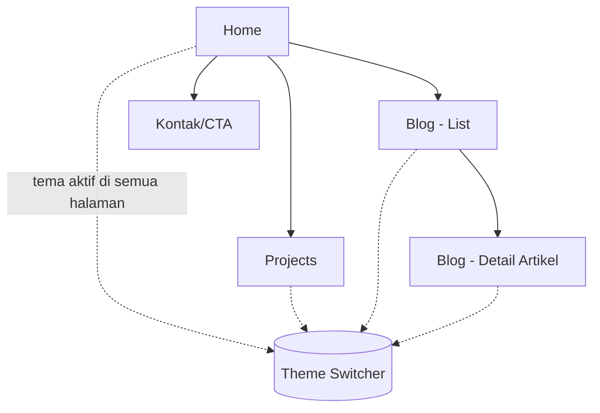
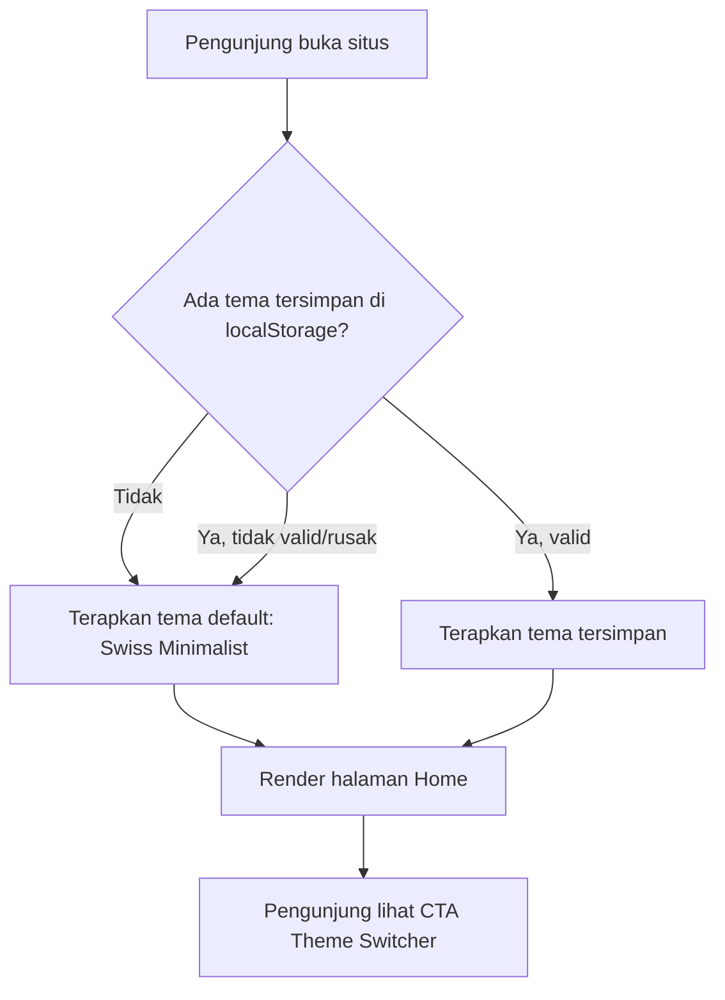
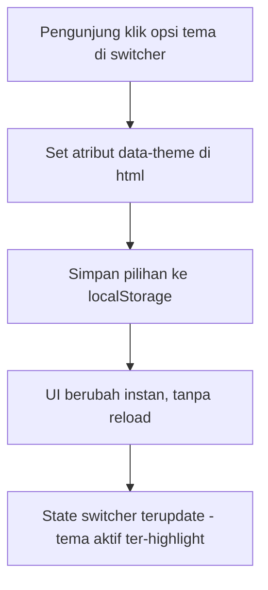
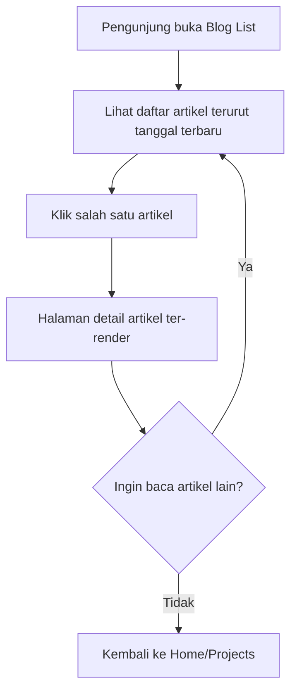

# UI/UX Flow — Personal Portfolio Website
Versi: 1.0 | Status: Draft | Turunan dari: PRD v1.0

---

## 1. Sitemap

Theme switcher bersifat global (ada di navbar/layout), berlaku di semua halaman — bukan fitur khusus satu halaman.

---

## 2. Flow: Kunjungan Pertama Kali

**Catatan UX:** langkah B-C-D harus selesai sebelum first paint (lihat SRS §3.1) — pengunjung tidak boleh melihat tema default lalu "berkedip" ke tema pilihannya.

---

## 3. Flow: Ganti Tema

**Catatan UX:**
- Transisi visual antar tema sebaiknya diberi sedikit CSS transition (mis. `transition: background-color 0.2s`) supaya perubahan terasa halus, bukan patah mendadak — tapi jangan berlebihan (bisa ganggu tema Kinetic/Neo Brutalism yang justru identitasnya "tegas").
- Switcher harus menampilkan state aktif dengan jelas (`aria-pressed`, visual indicator) untuk aksesibilitas.

---

## 4. Flow: Membaca Blog

---

## 5. Wireframe-Level Description per Halaman

### 5.1 Home
- Header: nama, tagline singkat, navigasi (Home / Projects / Blog), Theme Switcher.
- Hero section: perkenalan singkat + CTA ke Projects. *(kandidat island: animasi Motion/Three.js)*
- Highlight 2-3 project unggulan.
- Highlight 2-3 artikel blog terbaru.
- Footer: kontak, sosial media.

### 5.2 Projects
- Grid/list card project (judul, deskripsi singkat, tech stack, link demo/repo).
- Tiap card statis (tidak butuh island) kecuali ada preview interaktif.

### 5.3 Blog — List
- Daftar artikel: judul, tanggal, deskripsi singkat, tags.
- Filter/sort opsional (bisa fase berikutnya).

### 5.4 Blog — Detail
- Judul, tanggal publish/update, konten artikel (dari MDX).
- Bisa menyisipkan komponen interaktif di dalam MDX kalau perlu (mis. demo kode live).

### 5.5 Theme Switcher (komponen global)
- Muncul di navbar (desktop) — pertimbangkan versi ringkas (dropdown/icon) untuk mobile agar tidak makan tempat di semua tema, terutama tema minimalis.
- Highlight tema yang sedang aktif.

---

## 6. Pertimbangan Aksesibilitas Lintas-Tema

- Setiap tema harus lolos kontras WCAG AA minimum — cek khusus untuk Neumorphism (shadow lembut rawan kontras rendah).
- Fokus keyboard (`:focus-visible`) harus tetap terlihat jelas di semua tema, termasuk yang minim border seperti Swiss Minimalist.
- Animasi (island Motion) sebaiknya menghormati `prefers-reduced-motion` — terutama penting kalau nanti tema Kinetic ditambahkan di fase berikutnya.
